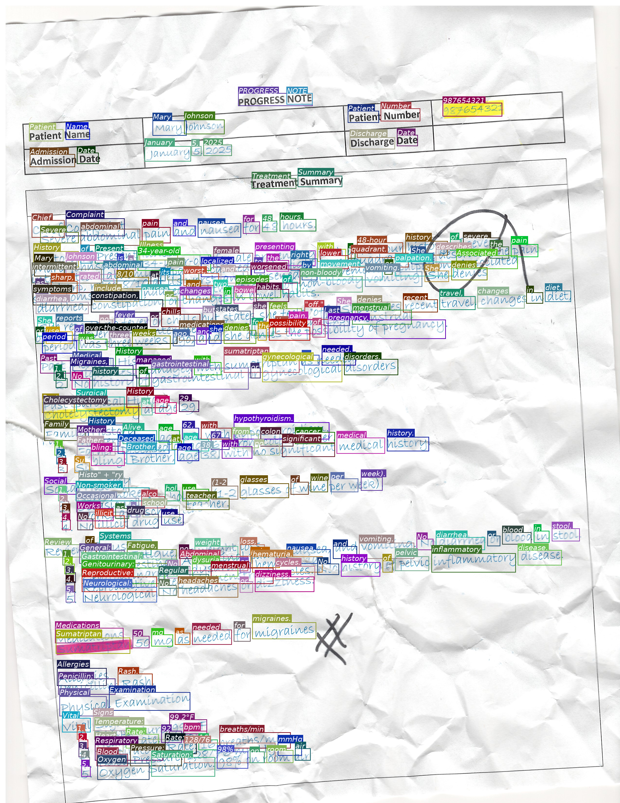
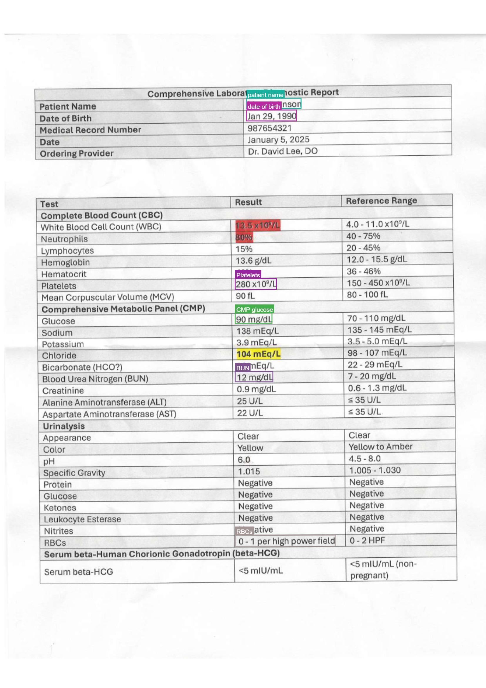

# BBox Mode

`output_mode="bbox"` extends regular OCR with per-region bounding boxes. Each page yields a list of `BBoxItem` records — `bbox=[x1, y1, x2, y2]` in absolute pixels, a `label`, and the OCR `text` for that region.

Two workflows are supported, controlled by the `user_prompt` parameter:

| Workflow | `user_prompt` | What the model returns |
|---|---|---|
| **Full-text bbox** | `None` / empty | Every region on the page, one box per line / word / segment |
| **Targeted extraction** | Free-text instruction (e.g., `"patient name and DOB"`) | Only regions that match the instruction |

## Model compatibility

Empirical results across tested VLM families:

| Model family | Full-text BBox | Targeted Extraction |
|---|:---:|:---:|
| **Qwen3.5/3.6** (e.g., `Qwen/Qwen3.5-35B-A3B`) | ✅ | ✅ |
| **Gemma 4** (e.g., `google/Gemma-4-26B-A4B-it`) | ⚠️ | ✅ |
| **GPT-4.1** (e.g., `gpt-4.1`, `gpt-4.1-mini`) | ❌ | ✅ |

**Legend**

- ✅ Works reliably out of the box.
- ⚠️ Works but may produce sparse or loosely-grouped boxes in full-text mode; targeted extraction is preferred.
- ❌ Does not reliably return bbox output in full-text mode; targeted extraction works.

!!! note
    These observations are from empirical testing on synthesized documents. Results vary with model version, document complexity, and prompt tuning.

## Setup

```python
from vlm4ocr import VLLMVLMEngine, OCREngine

# Qwen3-VL via vLLM (recommended for bbox)
vlm_engine = VLLMVLMEngine(model="Qwen/Qwen3.5-35B-A3B")
```

For other inference backends, see [VLM Engines](./vlm_engines.md).

---

## Full-text BBox OCR

Leave `user_prompt` empty (or omit it). The model transcribes the entire page and returns one bounding box per detected region.



### Sequential

```python
from vlm4ocr import VLLMVLMEngine, OCREngine

vlm_engine = VLLMVLMEngine(model="Qwen/Qwen3.5-35B-A3B")
ocr = OCREngine(vlm_engine=vlm_engine, output_mode="bbox")

ocr_results = ocr.sequential_ocr(image_path, verbose=True)

# Inspect results — pages are OCRPage dataclasses
for page in ocr_results[0].pages:
    print(f"Page has {len(page.bboxes)} regions")
    for item in page.bboxes:
        print(f"  [{item.label}] {item.bbox}  →  {item.text}")
```

### Concurrent

```python
import asyncio
from vlm4ocr import VLLMVLMEngine, OCREngine

vlm_engine = VLLMVLMEngine(model="Qwen/Qwen3.5-35B-A3B")
ocr = OCREngine(vlm_engine=vlm_engine, output_mode="bbox")

async def run_ocr():
    async for result in ocr.concurrent_ocr(
        [image_path_1, image_path_2, pdf_path],
        concurrent_batch_size=4,
    ):
        if result.status == "success":
            for page_num, page in enumerate(result.pages):
                annotated = page.plot_bboxes(show_label=False, show_text=True, color="random")
                annotated.save(f"{result.filename}_page{page_num}_bbox.png")

asyncio.run(run_ocr())
```

---

## Targeted Extraction

Pass a free-text instruction as `user_prompt`. The model returns only the regions matching the instruction — useful when you need specific fields from a structured document without processing the entire page.



### Sequential

```python
from vlm4ocr import VLLMVLMEngine, OCREngine

vlm_engine = VLLMVLMEngine(model="Qwen/Qwen3.5-35B-A3B")
ocr = OCREngine(
    vlm_engine=vlm_engine,
    output_mode="bbox",
    user_prompt="Extract patient name and date of birth",
)

ocr_results = ocr.sequential_ocr(image_path)

for item in ocr_results[0].pages[0].bboxes:
    print(item.label, "→", item.text)
```

### Concurrent

```python
import asyncio
from vlm4ocr import VLLMVLMEngine, OCREngine

vlm_engine = VLLMVLMEngine(model="Qwen/Qwen3.5-35B-A3B")
ocr = OCREngine(
    vlm_engine=vlm_engine,
    output_mode="bbox",
    user_prompt="Extract patient name, MRN, and date of birth",
)

async def run_ocr():
    async for result in ocr.concurrent_ocr(file_paths, concurrent_batch_size=4):
        if result.status == "success":
            for page in result.pages:
                for item in page.bboxes:
                    print(f"{result.filename}  {item.label}: {item.text}")

asyncio.run(run_ocr())
```

---

## Visualizing results

`OCRPage.plot_bboxes()` re-opens the source file, applies any rotation/resize that was used during OCR, and draws the boxes on top. It returns a `PIL.Image.Image` you can display or save.

The recommended appearance depends on the workflow:

**Full-text bbox** — no label categories, so use random colors and show only the transcribed text:

```python
for page_num, page in enumerate(ocr_results[0].pages):
    annotated = page.plot_bboxes(show_label=False, show_text=True, color="random")
    annotated.save(f"annotated_page{page_num}.png")
```

**Targeted extraction** — label categories are meaningful, so color by label and show both:

```python
for page_num, page in enumerate(ocr_results[0].pages):
    annotated = page.plot_bboxes(show_label=True, show_text=True, color="label")
    annotated.save(f"annotated_page{page_num}.png")
```

When both `show_label` and `show_text` are `True`, each box gets a single tag that reads **label**; *text* (bold label, italic text).

### Parameters

| Parameter | Type | Default | Description |
|---|---|---|---|
| `show_label` | `bool` | `True` | Draw the label (bold) in the tag above each box. |
| `show_text` | `bool` | `False` | Draw the OCR text (italic) in the tag above each box. |
| `color` | `str` | `"label"` | `"label"` = deterministic color per label; `"random"` = random color per box; any other string is a PIL color applied to all boxes (e.g. `"red"`, `"#E63946"`). |
| `box_width` | `int` | `3` | Outline thickness in pixels. |
| `font_size` | `int` | `20` | Font size in pixels. |
| `font_path` | `str \| None` | `None` | Path to a `.ttf` font; falls back to system fonts. |

### Lower-level `plot_bbox`

Call `plot_bbox` directly if you have your own image and `BBoxItem` list:

```python
from PIL import Image
from vlm4ocr import plot_bbox, BBoxItem

image = Image.open("document.jpg")
bboxes = [BBoxItem(bbox=[100, 50, 300, 80], label="name", text="Mary Johnson")]

# Targeted-style rendering
annotated = plot_bbox(bboxes, image, show_label=True, show_text=True, color="label")
```

---

## Per-VLM bbox formats

Different VLM families encode bbox output with different JSON key names, axis orders, and coordinate scales. `vlm4ocr` resolves the right format automatically by matching the model name against a registry. The built-in entries are:

| Pattern | `coord_scale` | `axis_order` | `bbox_key` |
|---|---|---|---|
| `qwen3` | `normalized_1000` | `x0y0x1y1` | `bbox_2d` |
| `gemma-4` | `normalized_1000` | `y0x0y1x1` | `box_2d` |
| `gemma-3` | `normalized_1000` | `y0x0y1x1` | `box_2d` |
| `gpt-4.1` | `normalized_1000` | `x0y0x1y1` | `bbox` |

If no pattern matches the model name, a default `BBoxFormat()` (`auto` scale, `x0y0x1y1` order, `bbox` key) is used and a warning is logged.

### Custom `BBoxFormat`

Override the auto-resolved format by passing a `BBoxFormat` instance to `OCREngine`:

```python
from vlm4ocr import OCREngine, BBoxFormat

ocr = OCREngine(
    vlm_engine=vlm_engine,
    output_mode="bbox",
    bbox_format=BBoxFormat(
        coord_scale="normalized_1000",  # "normalized_1000", "normalized_1", "auto", or "pixel"
        axis_order="x0y0x1y1",          # or "y0x0y1x1" for Gemma-style output
        bbox_key="bbox_2d",
        label_key="label",
        text_key="text",
        system_prompt_file="ocr_bbox_system_prompt_default.txt",
    ),
)
```

### Registering a format for a new model family

Use `register_bbox_format` to add a new entry to the registry at runtime — useful when integrating a model family not yet covered:

```python
from vlm4ocr import register_bbox_format, BBoxFormat

register_bbox_format(
    "my-custom-vlm",
    BBoxFormat(
        coord_scale="normalized_1000",
        axis_order="x0y0x1y1",
        bbox_key="bounding_box",
        label_key="category",
        text_key="content",
    ),
)

# Now OCREngine will pick up this format for any model whose name contains "my-custom-vlm"
```

---

## BBox items

Each element in `page.bboxes` is a `BBoxItem` dataclass:

```python
from vlm4ocr import BBoxItem

item = page.bboxes[0]
item.bbox   # [x1, y1, x2, y2] — absolute pixels in OCR-time image space
item.label  # str — category assigned by the model (e.g., "patient name")
item.text   # str — transcribed text for this region
```

Coordinates are in the pixel space of the image that was sent to the VLM (i.e., after any rotation and `max_dimension_pixels` resize). `page.image_width` and `page.image_height` reflect those dimensions.
