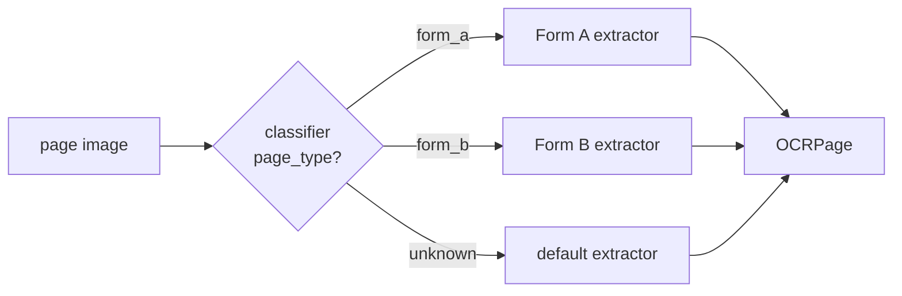

An [OCR engine](./ocr_engines.md) applies **one** system/user prompt to every page. That is ideal when all pages are processed the same way. But some documents are **heterogeneous** — a single PDF or TIFF can interleave different form types, each needing a different prompt or JSON schema. **OCR pipelines** solve this: you decide, *per page*, how that page is processed, while the pipeline owns the plumbing — file loading, concurrency, page ordering, error handling, and `OCRResult` assembly.

A pipeline is built from two pieces:

- [`OCREngine.ocr_image_async`](#the-atom-ocr_image_async) — the atomic building block: run one in-memory image through an engine's prompt.
- [`IndependentPagePipeline`](#independentpagepipeline) — a scaffold that turns a per-page function into a full concurrent, files-in / `OCRResult`-out pipeline.

## The atom: `ocr_image_async`
`OCREngine.ocr_image_async` runs a single, already-loaded `PIL.Image.Image` through the engine's configured prompt and `output_mode`, and returns a standalone `OCRPage`. It applies **no** image preprocessing (rotation/resize) — the caller owns that — so a page can be preprocessed once and reused across several engine calls.

```python
import asyncio
from PIL import Image
from vlm4ocr import VLLMVLMEngine, OCREngine

engine = OCREngine(VLLMVLMEngine(model="Qwen/Qwen3-VL-30B-A3B-Instruct"), output_mode="markdown")

image = Image.open("page.png")
page = asyncio.run(engine.ocr_image_async(image))
print(page.text)          # in bbox mode, page.bboxes / page.image_width / page.image_height are also populated
```

The returned `OCRPage` is *standalone* — it is not yet placed in an `OCRResult` (`image_processing_status={}`, `metadata={}`). Pass an optional `messages_logger` to capture the request/response for auditing.

## IndependentPagePipeline
`IndependentPagePipeline` wraps a per-page function into a concurrent pipeline whose `concurrent_ocr` mirrors [`OCREngine.concurrent_ocr`](./ocr_engines.md#concurrent-ocr) exactly — same arguments, same first-complete-first-out `AsyncGenerator[OCRResult, None]`, so it is a drop-in.

You supply `process_page(image, *, messages_logger=None) -> OCRPage`. It receives **only** its own page image (plus an optional log sink) and returns an `OCRPage`. Because it cannot see any other page, [independence](#the-independence-assumption) is guaranteed by construction. The pipeline handles the rest: loading, optional preprocessing (`rotate_correction`, `max_dimension_pixels`), the two-level concurrency (`concurrent_batch_size`, `max_file_load`), page ordering, and assembling one `OCRResult` per file.

```python
import asyncio
from vlm4ocr import OCREngine, IndependentPagePipeline, OCRPage

engine = OCREngine(vlm_engine, output_mode="markdown")

async def process_page(image, *, messages_logger=None) -> OCRPage:
    return await engine.ocr_image_async(image, messages_logger=messages_logger)

pipeline = IndependentPagePipeline(process_page, output_mode="markdown", max_dimension_pixels=4000)

async def run():
    async for result in pipeline.concurrent_ocr(file_paths, concurrent_batch_size=4):
        if result.status == "success":
            with open(f"{result.filename}.md", "w", encoding="utf-8") as f:
                f.write(result.to_string())

asyncio.run(run())
```

`process_page` can attach per-page information through `OCRPage.metadata`, which is preserved on each page of the resulting `OCRResult`:

```python
async def process_page(image, *, messages_logger=None) -> OCRPage:
    page = await engine.ocr_image_async(image, messages_logger=messages_logger)
    page.metadata["char_count"] = len(page.text)
    return page
```

!!! note
    `rotate_correction` at the pipeline layer supports `"tesseract"` (or `False`). VLM-based rotation needs an engine and is not offered here — perform it inside `process_page` if you need it.

## Example: routing pages to different extractors
This is the motivating use case: a heterogeneous document whose pages must be extracted with **different** JSON schemas. Use one engine as a **classifier** and a set of engines as per-type **extractors**, then route each page inside `process_page`.



```python
import json
import asyncio
from vlm4ocr import OCREngine, IndependentPagePipeline, OCRPage

# One classifier + one extractor per page type + a fallback. Each engine is an
# atom: one prompt, one task.
classifier = OCREngine(vlm_engine, output_mode="JSON",
                       user_prompt='Classify this page. Respond as JSON: {"page_type": "<one_token>"}')
extractors = {
    "form_a": OCREngine(vlm_engine, output_mode="JSON", user_prompt="<form A schema>"),
    "form_b": OCREngine(vlm_engine, output_mode="JSON", user_prompt="<form B schema>"),
}
default = OCREngine(vlm_engine, output_mode="JSON", user_prompt="<generic schema>")

def read_page_type(classifier_text: str) -> str:
    data = json.loads(classifier_text)            # JSON mode returns a JSON array string
    if isinstance(data, list):
        data = data[0] if data else {}
    return data.get("page_type", "unknown")

async def classify_and_extract(image, *, messages_logger=None) -> OCRPage:
    # Sees only its own image -> independent. Both calls share the logger for one audit trail.
    classification = await classifier.ocr_image_async(image, messages_logger=messages_logger)
    page_type = read_page_type(classification.text)
    extractor = extractors.get(page_type, default)
    page = await extractor.ocr_image_async(image, messages_logger=messages_logger)
    page.metadata["page_type"] = page_type
    return page

pipeline = IndependentPagePipeline(classify_and_extract, output_mode="JSON")

async def run():
    async for result in pipeline.concurrent_ocr(pdf_paths, concurrent_batch_size=8):
        for page in result.pages:
            print(page.metadata["page_type"], page.text)

asyncio.run(run())
```

All routing logic — the classifier prompt, the schemas, the type labels — lives in *your* code; the pipeline only orchestrates. Because both the classify and extract calls share the `messages_logger`, both are captured in `OCRResult.get_messages_log()`.

## The independence assumption
`IndependentPagePipeline` assumes every page's output depends **only on its own image**. This is what makes pages safe to process concurrently and reorder, and it is enforced structurally: `process_page` only ever receives its own image. Each input page maps to exactly one `OCRPage` (1:1).

It fits when a page can be handled in isolation:

- routing by per-page type (above)
- per-page classification or tagging
- multi-pass refinement on the *same* page (e.g., extract, then validate/repair its JSON)

It does **not** fit when a page depends on other pages. Keep these out of `IndependentPagePipeline`:

- **cross-page dependence** — a page's result depends on another page (continuation pages, a table spanning pages)
- **document-level shared context** — a value computed once and applied to all pages (e.g., "classify the whole document from page 1, then apply that type to every page")

For those, define a `process_page` that does not rely on sibling pages, or use a different orchestration.
