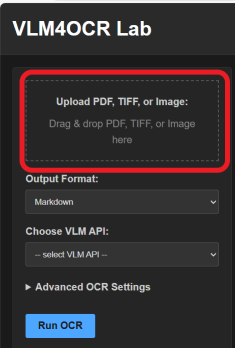
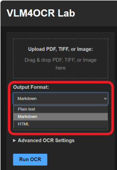
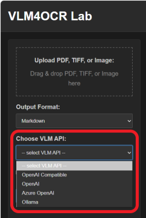
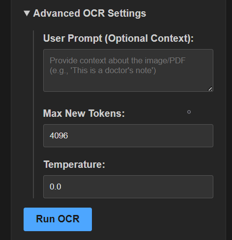

A ready-to-use web application is included. It supports input preview, real-time streaming, and output export. 


## Installation
### Running with Docker
The easiest way to run VLM4OCR web application is through [Docker](https://docs.docker.com/get-started/get-docker/). The image is available on Docker Hub.
```sh
docker pull daviden1013/vlm4ocr-app:latest
docker run -p 5000:5000 daviden1013/vlm4ocr-app:latest
```
Open your web browser and navigate to:
http://localhost:5000

If port 5000 is already in use on your machine, you can map it to a different local port. For example, to map it to local port 8080:
```sh
docker run -p 8080:5000 daviden1013/vlm4ocr-app:latest
```
Then visit http://localhost:8080

#### Using Ollama with the Dockerized App
If you are running Ollama on your host machine (outside the Docker container) and want to connect to it from the VLM4OCR web app running inside Docker:

**Docker Desktop (Windows/Mac):** In the VLM4OCR web UI, set the Ollama Host to http://host.docker.internal:11434.
**Linux:** Run the Docker container with host networking:
```sh
docker run --network="host" daviden1013/vlm4ocr-app:latest
```
With `--network="host"`, you don't need the `-p` flag for port mapping (the container will use the host's network directly, so the app will be available at http://localhost:5000). Then, in the VLM4OCR web app, you can use the default http://localhost:11434 for the Ollama Host.

### Install from source
Alternatively, you can clone this repo and run VLM4OCR web application from source:
```bash
# Install python package
pip install vlm4ocr 

# Clone source code
git clone https://github.com/daviden1013/vlm4ocr.git

# Run Web App
cd vlm4ocr/services/web_app
python run.py
```

## Usage
#### Upload image, PDF, TIFF for OCR
Drag-and-drop or click on the file upload area to select a file for upload. The file must be an image, PDF, or TIFF. Once uploaded, a preview will display in the *input preview* area on the right. 



#### Select output mode
Use the dropdown to select an output mode:

- plain text
- markdown
- HTML



#### Select VLM API
Use the dropdown to select an VLM API:

- OpenAI compatible
- OpenAI
- Azure OpenAI
- Ollama

Once selected, further options such as API key, model name, and deployment will show.



#### Advanced OCR settings
Write a user prompt to specify the document type and provide VLM with additional information. For example, "The input is a comprehensive metabolic panel report". Specify output tokens to manage computation resources and temperature to increase output stabability.

